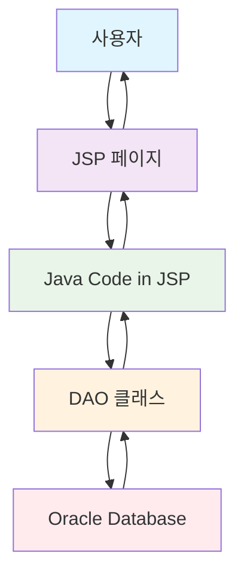
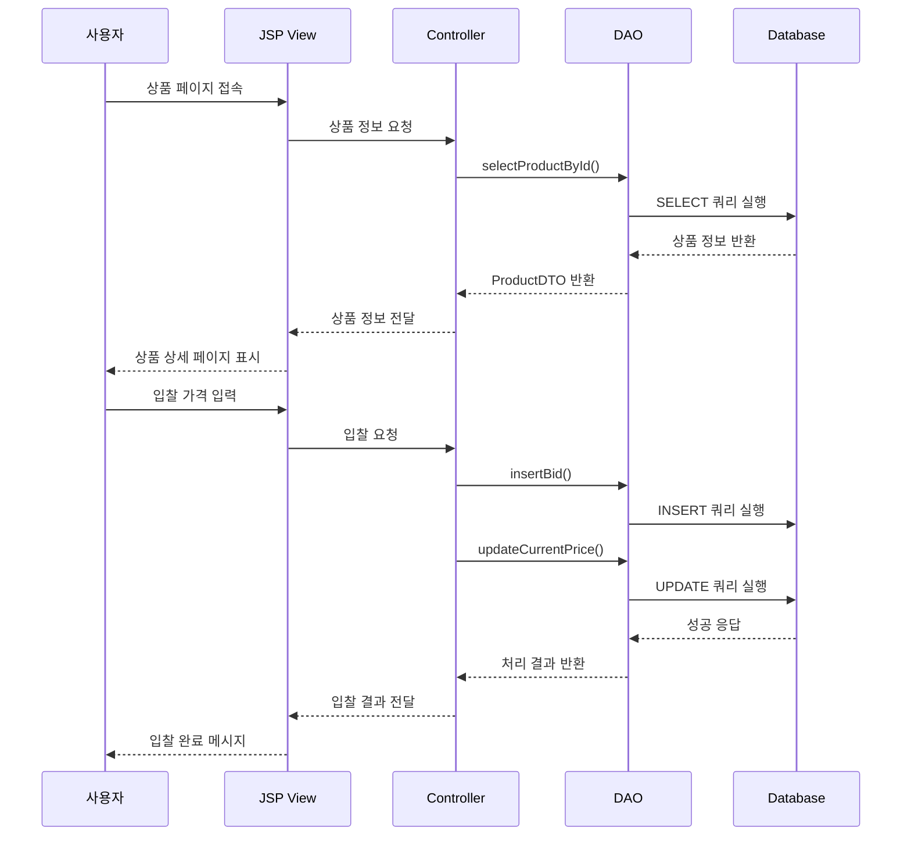

# ACU 프로젝트 구조 분석 프레젠테이션

---

## 슬라이드 1: 프로젝트 개요

### 🎯 프로젝트명
**ACU (Auction) - 온라인 미술품 경매 시스템**

### 🛠️ 기술 스택
- **Backend**: Java, JSP
- **Database**: Oracle (JDBC)
- **Frontend**: HTML5, CSS3, JavaScript
- **Server**: Apache Tomcat
- **Architecture**: JSP Model 1 Pattern

### 📋 주요 기능
- 회원 관리 시스템 (일반/VIP/관리자)
- 상품 등록 및 관리
- 실시간 경매 시스템
- 마일리지 시스템
- 관리자 대시보드

---

## 슬라이드 2: 프로젝트 폴더 구조

```
📁 acu/
├── 📁 src/main/java/com/auction/
│   ├── 📁 common/           # 공통 유틸리티
│   │   ├── JDBCTemplate.java    # DB 연결 관리
│   │   ├── PageInfo.java        # 페이징 처리
│   │   └── SHA256.java          # 비밀번호 암호화
│   ├── 📁 dao/              # 데이터 액세스 계층
│   │   ├── AdminDAO.java        # 관리자 DB 작업
│   │   ├── BidDAO.java          # 입찰 DB 작업
│   │   ├── MemberDAO.java       # 회원 DB 작업
│   │   ├── ProductDAO.java      # 상품 DB 작업
│   │   ├── VipDAO.java          # VIP 회원 DB 작업
│   │   └── WishlistDAO.java     # 관심상품 DB 작업
│   ├── 📁 dto/              # 데이터 전송 객체
│   │   ├── BidDTO.java          # 입찰 정보
│   │   ├── MemberDTO.java       # 회원 정보
│   │   ├── ProductDTO.java      # 상품 정보
│   │   └── VipBenefitDTO.java   # VIP 혜택 정보
│   └── 📁 scheduler/        # 스케줄러
│       └── AuctionScheduler.java # 경매 자동 종료
├── 📁 src/main/webapp/
│   ├── 📁 admin/            # 관리자 페이지
│   ├── 📁 auction/          # 경매 페이지
│   ├── 📁 member/           # 회원 관리 페이지
│   ├── 📁 product/          # 상품 관리 페이지
│   ├── 📁 mypage/           # 마이페이지
│   ├── 📁 wishlist/         # 관심상품 페이지
│   └── 📁 resources/        # 정적 리소스
│       ├── 📁 css/              # 스타일시트
│       ├── 📁 js/               # 자바스크립트
│       └── 📁 product_images/   # 상품 이미지
└── 📁 database/             # DB 스키마
    ├── create_vip_tables.sql
    ├── create_wishlist_table.sql
    └── create_transaction_log_table.sql
```

---

## 슬라이드 3: 아키텍처 패턴 - JSP Model 1



### 🔄 처리 흐름
1. **사용자 요청** → JSP 페이지 (예: loginForm.jsp)
2. **폼 제출** → Action JSP 페이지 (예: loginAction.jsp)
3. **비즈니스 로직** → JSP 내부 Java 코드에서 DAO 호출
4. **데이터 접근** → DAO 클래스 → Oracle Database
5. **결과 처리** → JSP 페이지에서 직접 결과 처리 및 화면 이동

---

## 슬라이드 4: 핵심 파일 분석 - JDBCTemplate.java

### 🔧 역할
데이터베이스 연결 및 트랜잭션 관리를 담당하는 핵심 유틸리티

### 💡 주요 기능
```java
public class JDBCTemplate {
    // 🔗 데이터베이스 연결 생성
    public static Connection getConnection() {
        // Oracle DB 연결 정보를 properties 파일에서 읽음
        // 자동 커밋 비활성화로 트랜잭션 제어
    }
    
    // ✅ 트랜잭션 커밋
    public static void commit(Connection conn) { ... }
    
    // ❌ 트랜잭션 롤백
    public static void rollback(Connection conn) { ... }
    
    // 🔐 리소스 정리
    public static void close(Connection conn) { ... }
    public static void close(Statement stmt) { ... }
    public static void close(ResultSet rs) { ... }
}
```

### 🎯 디자인 패턴
- **Singleton Pattern**: 하나의 연결 관리자
- **Template Method Pattern**: 공통 DB 작업 템플릿

---

## 슬라이드 5: 핵심 파일 분석 - ProductDAO.java

### 🛍️ 역할
상품 관련 모든 데이터베이스 작업을 담당

### 📊 주요 메서드
```java
public class ProductDAO {
    // 📋 상품 목록 조회
    public List<ProductDTO> selectProductList(Connection conn, PageInfo pi);
    
    // 🔍 상품 상세 조회
    public ProductDTO selectProductById(Connection conn, int productId);
    
    // ➕ 상품 등록
    public int insertProduct(Connection conn, ProductDTO product);
    
    // 💰 입찰 처리
    public int insertBid(Connection conn, BidDTO bid);
    public int updateCurrentPrice(Connection conn, int productId, long bidPrice);
    
    // 🏆 낙찰 처리
    public BidDTO findWinner(Connection conn, int productId);
    public int updateProductWinner(Connection conn, int productId, 
                                  String winnerId, int finalPrice);
    
    // 🔄 상품 상태 변경
    public int updateProductStatus(Connection conn, int productId, String status);
}
```

### 🎨 특별 기능
- **페이징 처리**: 대량 데이터 효율적 조회
- **검색 기능**: 키워드, 카테고리별 검색
- **실시간 업데이트**: 입찰가 실시간 반영

---

## 슬라이드 6: 핵심 파일 분석 - ProductDTO.java

### 📦 역할
상품 정보를 담는 데이터 전송 객체

### 🗂️ 주요 필드
```java
public class ProductDTO {
    private int productId;           // 상품 ID
    private String productName;      // 상품명
    private String artistName;       // 작가명
    private String productDesc;      // 상품 설명
    private int startPrice;          // 시작가
    private int currentPrice;        // 현재가
    private int buyNowPrice;         // 즉시구매가
    private Timestamp endTime;       // 경매 종료시간
    private String imageRenamedName; // 이미지 파일명
    private String category;         // 카테고리
    private String sellerId;         // 판매자 ID
    private String status;           // 상품 상태
    private String winnerId;         // 낙찰자 ID
    private int finalPrice;          // 최종 낙찰가
    private Integer bidCount;        // 입찰 수
    private Integer viewCount;       // 조회 수
    
    // getter/setter 메서드들...
}
```

### 🔄 상태 관리
- **P**: 승인 대기 (Pending)
- **A**: 경매 진행 (Active)
- **E**: 경매 종료 (Ended)
- **C**: 취소 (Cancelled)

---

## 슬라이드 7: 데이터베이스 스키마

### 🗄️ 주요 테이블
```sql
-- 회원 테이블
CREATE TABLE USERS (
    MEMBER_ID VARCHAR2(50) PRIMARY KEY,
    MEMBER_NAME VARCHAR2(100) NOT NULL,
    EMAIL VARCHAR2(100) UNIQUE,
    MILEAGE NUMBER DEFAULT 0,
    MEMBER_TYPE VARCHAR2(10) DEFAULT 'GENERAL'
);

-- 상품 테이블
CREATE TABLE PRODUCT (
    PRODUCT_ID NUMBER PRIMARY KEY,
    PRODUCT_NAME VARCHAR2(200) NOT NULL,
    ARTIST_NAME VARCHAR2(100),
    START_PRICE NUMBER NOT NULL,
    CURRENT_PRICE NUMBER DEFAULT 0,
    END_TIME TIMESTAMP,
    SELLER_ID VARCHAR2(50) REFERENCES USERS(MEMBER_ID),
    STATUS VARCHAR2(10) DEFAULT 'P'
);

-- 입찰 테이블
CREATE TABLE BID (
    BID_ID NUMBER PRIMARY KEY,
    PRODUCT_ID NUMBER REFERENCES PRODUCT(PRODUCT_ID),
    BIDDER_ID VARCHAR2(50) REFERENCES USERS(MEMBER_ID),
    BID_PRICE NUMBER NOT NULL,
    BID_TIME TIMESTAMP DEFAULT SYSDATE
);
```

### 🔗 테이블 관계
- **USERS** ↔ **PRODUCT**: 1:N (한 명의 사용자가 여러 상품 판매)
- **PRODUCT** ↔ **BID**: 1:N (한 상품에 여러 입찰)
- **USERS** ↔ **BID**: 1:N (한 사용자가 여러 입찰)

---

## 슬라이드 8: JSP Model 1 실제 코드 예시

### 🔑 로그인 처리 과정
```jsp
<%-- loginForm.jsp: 로그인 폼 --%>
<form action="loginAction.jsp" method="post">
    <input type="text" name="userId" placeholder="아이디" required>
    <input type="password" name="userPwd" placeholder="비밀번호" required>
    <button type="submit">로그인</button>
</form>
```

```jsp
<%-- loginAction.jsp: 로그인 처리 --%>
<%@ page import="com.auction.dto.MemberDTO" %>
<%@ page import="com.auction.dao.MemberDAO" %>
<%@ page import="static com.auction.common.JDBCTemplate.*" %>

<%
    // 1. 파라미터 받기
    String userId = request.getParameter("userId");
    String userPwd = request.getParameter("userPwd");
    
    // 2. 비즈니스 로직 처리
    Connection conn = getConnection();
    MemberDTO loginUser = new MemberDAO().loginMember(conn, userId, userPwd);
    close(conn);
    
    // 3. 결과 처리
    if(loginUser != null) {
        session.setAttribute("loginUser", loginUser);
        response.sendRedirect("../index.jsp");
    } else {
        request.setAttribute("errorMsg", "로그인 실패");
        request.getRequestDispatcher("loginForm.jsp").forward(request, response);
    }
%>
```

### 💰 입찰 처리 과정
```jsp
<%-- bidAction.jsp: 입찰 처리 --%>
<%@ page import="com.auction.dto.BidDTO" %>
<%@ page import="com.auction.dao.ProductDAO" %>
<%@ page import="static com.auction.common.JDBCTemplate.*" %>

<%
    // 1. 파라미터 받기
    int productId = Integer.parseInt(request.getParameter("productId"));
    int bidPrice = Integer.parseInt(request.getParameter("bidPrice"));
    MemberDTO loginUser = (MemberDTO)session.getAttribute("loginUser");
    
    // 2. 비즈니스 로직 처리
    Connection conn = getConnection();
    ProductDAO dao = new ProductDAO();
    
    try {
        // 입찰 정보 저장
        BidDTO bid = new BidDTO();
        bid.setProductId(productId);
        bid.setMemberId(loginUser.getMemberId());
        bid.setBidPrice(bidPrice);
        
        int result1 = dao.insertBid(conn, bid);
        int result2 = dao.updateCurrentPrice(conn, productId, bidPrice);
        
        if(result1 > 0 && result2 > 0) {
            commit(conn);
            response.sendRedirect("auctionDetail.jsp?productId=" + productId);
        } else {
            rollback(conn);
            request.setAttribute("errorMsg", "입찰 실패");
            request.getRequestDispatcher("auctionDetail.jsp").forward(request, response);
        }
    } catch(Exception e) {
        rollback(conn);
        e.printStackTrace();
    } finally {
        close(conn);
    }
%>
```

---

## 슬라이드 9: 웹 페이지 구조

### 🏠 메인 페이지 (index.jsp)
```jsp
<%-- 메인 페이지 구조 --%>
<div class="main-container">
    <header>
        <%@ include file="layout/header/luxury-header.jsp" %>
    </header>
    
    <main>
        <section class="hero-section">
            <h1>M4 Auction</h1>
            <p>프리미엄 미술품 경매 플랫폼</p>
        </section>
        
        <section class="auction-categories">
            <div class="category-grid">
                <div class="category-item">프리미엄 경매</div>
                <div class="category-item">위클리 경매</div>
                <div class="category-item">제로베이스 경매</div>
            </div>
        </section>
        
        <section class="featured-auctions">
            <h2>주요 경매</h2>
            <div class="product-grid">
                <% for(ProductDTO product : featuredProducts) { %>
                    <div class="product-card">
                        " />
                        <h3><%= product.getProductName() %></h3>
                        <p>현재가: <%= product.getCurrentPrice() %>원</p>
                    </div>
                <% } %>
            </div>
        </section>
    </main>
    
    <footer>
        <%@ include file="layout/footer/luxury-footer.jsp" %>
    </footer>
</div>
```

### 🎨 스타일링 (CSS)
- **반응형 디자인**: 모바일, 태블릿, 데스크톱 대응
- **모던 UI**: 카드 레이아웃, 그라데이션 효과
- **사용자 경험**: 직관적인 네비게이션, 시각적 피드백

---

## 슬라이드 9: 주요 기능 플로우

### 🔄 경매 참여 프로세스


### ⚡ 스케줄러 동작
- **AuctionScheduler**: 경매 종료 시간 체크
- **자동 처리**: 낙찰자 결정 및 상태 업데이트
- **실시간 반영**: 진행 상황 즉시 업데이트

---

## 슬라이드 10: 코드 하이라이트 - 실시간 입찰 처리

### 💰 입찰 처리 핵심 로직
```java
// bidAction.jsp에서 입찰 처리
public class BidProcessor {
    public boolean processBid(int productId, String bidderId, long bidPrice) {
        Connection conn = null;
        boolean success = false;
        
        try {
            conn = JDBCTemplate.getConnection();
            
            // 1. 현재 상품 정보 확인
            ProductDTO product = new ProductDAO().selectProductById(conn, productId);
            
            // 2. 입찰 가격 유효성 검사
            if (bidPrice <= product.getCurrentPrice()) {
                throw new IllegalArgumentException("입찰가가 현재가보다 낮습니다.");
            }
            
            // 3. 입찰자 마일리지 확인
            MemberDTO member = new MemberDAO().selectMemberById(conn, bidderId);
            if (member.getMileage() < bidPrice) {
                throw new IllegalArgumentException("마일리지가 부족합니다.");
            }
            
            // 4. 입찰 정보 저장
            BidDTO bid = new BidDTO();
            bid.setProductId(productId);
            bid.setMemberId(bidderId);
            bid.setBidPrice((int)bidPrice);
            
            ProductDAO dao = new ProductDAO();
            int result1 = dao.insertBid(conn, bid);
            
            // 5. 현재가 업데이트
            int result2 = dao.updateCurrentPrice(conn, productId, bidPrice);
            
            if (result1 > 0 && result2 > 0) {
                JDBCTemplate.commit(conn);
                success = true;
            } else {
                JDBCTemplate.rollback(conn);
            }
            
        } catch (Exception e) {
            JDBCTemplate.rollback(conn);
            e.printStackTrace();
        } finally {
            JDBCTemplate.close(conn);
        }
        
        return success;
    }
}
```

### 🔒 보안 고려사항
- **트랜잭션 처리**: 원자성 보장
- **예외 처리**: 에러 상황 대응
- **입력 검증**: SQL 인젝션 방지

---

## 슬라이드 11: 고급 기능 - 스케줄러 시스템

### ⏰ 경매 자동 종료 시스템
```java
public class AuctionScheduler {
    private ScheduledExecutorService scheduler;
    private Map<Integer, Future<?>> scheduledTasks;
    
    public void scheduleAuctionEnd(int productId, Timestamp endTime) {
        long delay = endTime.getTime() - System.currentTimeMillis();
        
        if (delay > 0) {
            AuctionCloseTask task = new AuctionCloseTask(productId);
            Future<?> future = scheduler.schedule(task, delay, TimeUnit.MILLISECONDS);
            scheduledTasks.put(productId, future);
        }
    }
    
    private class AuctionCloseTask implements Runnable {
        private int productId;
        
        @Override
        public void run() {
            Connection conn = null;
            try {
                conn = JDBCTemplate.getConnection();
                ProductDAO dao = new ProductDAO();
                
                // 1. 최고 입찰자 찾기
                BidDTO winner = dao.findWinner(conn, productId);
                
                if (winner != null) {
                    // 2. 낙찰자 정보 업데이트
                    dao.updateProductWinner(conn, productId, 
                                          winner.getMemberId(), 
                                          winner.getBidPrice());
                    
                    // 3. 상품 상태를 '경매 종료'로 변경
                    dao.updateProductStatus(conn, productId, "E");
                    
                    JDBCTemplate.commit(conn);
                    
                    // 4. 낙찰자에게 알림 발송 (추후 구현)
                    // NotificationService.sendWinnerNotification(winner);
                }
                
            } catch (Exception e) {
                JDBCTemplate.rollback(conn);
                e.printStackTrace();
            } finally {
                JDBCTemplate.close(conn);
            }
        }
    }
}
```

### 📊 성능 최적화
- **Connection Pool**: 데이터베이스 연결 재사용
- **배치 처리**: 대량 데이터 효율적 처리
- **캐싱**: 자주 조회되는 데이터 메모리 저장

---

## 슬라이드 12: 사용자 경험 (UX) 개선

### 🎨 반응형 디자인
```css
/* 반응형 그리드 레이아웃 */
.product-grid {
    display: grid;
    grid-template-columns: repeat(auto-fit, minmax(300px, 1fr));
    gap: 20px;
    padding: 20px;
}

.product-card {
    background: white;
    border-radius: 12px;
    box-shadow: 0 4px 6px rgba(0, 0, 0, 0.1);
    overflow: hidden;
    transition: transform 0.3s ease;
}

.product-card:hover {
    transform: translateY(-5px);
    box-shadow: 0 8px 25px rgba(0, 0, 0, 0.15);
}

/* 모바일 대응 */
@media (max-width: 768px) {
    .product-grid {
        grid-template-columns: 1fr;
        padding: 10px;
    }
}
```

### ⚡ 자바스크립트 상호작용
```javascript
// 실시간 입찰 업데이트
class RealTimeBidding {
    constructor(productId) {
        this.productId = productId;
        this.startPolling();
    }
    
    startPolling() {
        setInterval(() => {
            this.updateCurrentPrice();
        }, 3000); // 3초마다 업데이트
    }
    
    updateCurrentPrice() {
        fetch(`/acu/api/product/${this.productId}/current-price`)
            .then(response => response.json())
            .then(data => {
                document.getElementById('current-price').textContent = 
                    data.currentPrice.toLocaleString() + '원';
                document.getElementById('bid-count').textContent = 
                    data.bidCount + '건';
            });
    }
    
    submitBid(bidPrice) {
        fetch('/acu/product/bidAction.jsp', {
            method: 'POST',
            headers: {
                'Content-Type': 'application/x-www-form-urlencoded',
            },
            body: `productId=${this.productId}&bidPrice=${bidPrice}`
        })
        .then(response => response.json())
        .then(data => {
            if (data.success) {
                this.showSuccessMessage('입찰이 완료되었습니다!');
                this.updateCurrentPrice();
            } else {
                this.showErrorMessage(data.message);
            }
        });
    }
}
```

---

## 슬라이드 13: 보안 및 성능

### 🔒 보안 기능
```java
// 비밀번호 암호화
public class SHA256 {
    public static String encrypt(String plainText) {
        try {
            MessageDigest md = MessageDigest.getInstance("SHA-256");
            md.update(plainText.getBytes());
            byte[] digest = md.digest();
            
            StringBuilder sb = new StringBuilder();
            for (byte b : digest) {
                sb.append(String.format("%02x", b));
            }
            return sb.toString();
        } catch (NoSuchAlgorithmException e) {
            throw new RuntimeException(e);
        }
    }
}

// 세션 관리
public class SessionManager {
    public static boolean isLoggedIn(HttpServletRequest request) {
        HttpSession session = request.getSession(false);
        return session != null && session.getAttribute("loginMember") != null;
    }
    
    public static void logout(HttpServletRequest request) {
        HttpSession session = request.getSession(false);
        if (session != null) {
            session.invalidate();
        }
    }
}
```

### 📈 성능 최적화 기법
- **페이징**: 대량 데이터 분할 조회
- **인덱싱**: 데이터베이스 검색 성능 향상
- **캐싱**: 자주 사용되는 데이터 메모리 저장
- **Connection Pool**: 데이터베이스 연결 재사용

---

## 슬라이드 14: 향후 개선 방향

### 🚀 기술 업그레이드
- **Spring Framework**: 의존성 주입, AOP
- **MyBatis**: SQL 매핑 프레임워크
- **RESTful API**: 모바일 앱 대응
- **WebSocket**: 실시간 통신

### 🎯 기능 확장
- **결제 시스템**: 실제 결제 연동
- **추천 시스템**: AI 기반 상품 추천
- **모바일 앱**: 네이티브 앱 개발
- **국제화**: 다국어 지원

### 🔧 운영 개선
- **로깅 시스템**: 상세한 로그 관리
- **모니터링**: 성능 및 에러 추적
- **백업/복구**: 데이터 안전성 강화
- **CDN**: 이미지 및 정적 파일 최적화

---

## 슬라이드 15: 프로젝트 성과 및 학습 포인트

### 🏆 프로젝트 성과
- **완성도**: 핵심 기능 구현 완료
- **사용자 경험**: 직관적이고 반응적인 UI
- **확장성**: 모듈화된 구조로 유지보수 용이
- **보안**: 기본적인 보안 요소 적용

### 📚 학습 포인트
1. **MVC 패턴**: 구조적 개발 방법론
2. **데이터베이스 설계**: 정규화와 관계 설정
3. **트랜잭션 처리**: 데이터 일관성 보장
4. **웹 개발**: 사용자 인터페이스 구현
5. **팀 협업**: 코드 리뷰 및 문서화

### 🎯 실무 적용 가능성
- **포트폴리오**: 취업 준비 시 활용
- **기술 면접**: 프로젝트 경험 어필
- **실무 적응**: 유사한 시스템 개발 경험
- **기술 성장**: 추가 기술 학습 기반

---

## 슬라이드 16: 결론

### 💭 프로젝트 의의
ACU 프로젝트는 **실무 환경과 유사한 복잡한 비즈니스 로직**을 구현하여 웹 개발의 전 과정을 경험할 수 있는 종합적인 학습 프로젝트입니다.

### 🎓 핵심 성취
- **Full-Stack 개발**: 백엔드부터 프론트엔드까지
- **실시간 시스템**: 경매 특성상 실시간 처리 구현
- **복잡한 비즈니스 로직**: 경매, 입찰, 결제 등 실무 수준의 기능
- **사용자 중심 설계**: UX/UI 고려한 인터페이스

### 🌟 향후 활용 방안
1. **포트폴리오 개선**: 추가 기능 구현
2. **기술 스택 업그레이드**: 최신 기술 도입
3. **실제 서비스 런칭**: 상용화 가능성 탐색
4. **오픈소스 기여**: 커뮤니티 참여

---

### 📞 Q&A

**질문과 답변 시간입니다!**

프로젝트 구조나 기술적 내용에 대해 궁금한 점이 있으시면 언제든지 물어보세요.

---

*본 프레젠테이션은 ACU 프로젝트의 구조와 핵심 기능을 종합적으로 분석한 자료입니다.*